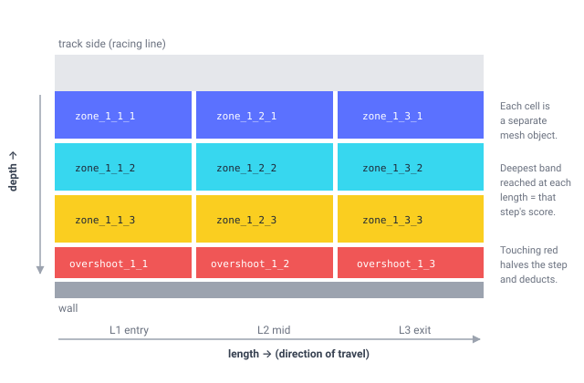

# Judge a drift run the way a panel would

**CHAPPiE** scores runs in **CarX Drift Racing Online** against zones *you* define in your own map — line depth, angle, consistency and style — and runs the whole session around it: host-controlled qualifying, a live lobby scoreboard, judge review, retroactive DQ and a CSV results sheet.

You don't script anything. You split a zone into a grid of invisible meshes, name them, and the mod scores whatever it finds.



---

## Start here

| | |
|---|---|
| ⬇️ **[Download](download.md)** | The mod and the track SDK, straight from here. |
| 🏁 **[Getting started](getting-started.md)** | Install the mod, assign staff, run a session. |
| 🛠️ **[Track authoring](tutorials/)** | The full pipeline: design the grid, build it in Maya or Blender, set it up in Unity, export through Kino. |
| 📐 **[Naming contract](reference/naming-contract.md)** | Every GameObject name the mod reads. The actual interface. |
| 🧮 **[Scoring model](reference/scoring-model.md)** | How a run becomes a number. |
| ⛔ **[DQ and deduction rules](reference/dq-rules.md)** | What zeroes or reduces a run, with every threshold. |
| 🧩 **[SDK components](reference/components.md)** | Field-by-field Unity component reference. |

---

## How the two halves fit together

CHAPPiE is split into a **mod** and an **SDK**, and they never talk to each other directly.

The SDK is a handful of editor-only Unity scripts. They don't ship inside your map and they don't run in game — all they do is rename GameObjects to a fixed convention while you're authoring. Custom MonoBehaviours don't survive the AssetBundle round-trip into CarX, so a component can't be the carrier.

The mod scans the loaded scene for those **names**. That's the entire interface.

```
Maya / Blender          Unity + SDK              CarX + CHAPPiE
──────────────          ───────────              ──────────────
split zone meshes  →    components rename   →    mod finds
by depth band           the GameObjects           "zone_1_3_2"
                        to the contract           and scores it
```

The practical consequence, and the thing worth internalising before you start: **the names are the contract.** You can author a fully working CHAPPiE track with no SDK at all, by naming meshes by hand. The SDK exists so you don't have to, and so a typo becomes an inspector field instead of a silent scoring hole.

---

## Status

CHAPPiE is in active development and used for real events. The naming contract is additive-only — a map authored against it keeps working across mod updates.

**[Download the mod and SDK](download.md)** — both served from this site, with a build date and SHA-256 for each.

If you'd rather pull from source:

- **SDK + these docs** — [udsm_drift_scoring_sdk](https://github.com/StuartLTL/udsm_drift_scoring_sdk)
- **Release binaries** — [udsm_drift_scoring_public](https://github.com/StuartLTL/udsm_drift_scoring_public)

Both are mirrored automatically from the private development repo, so what you see here always matches a real build.
